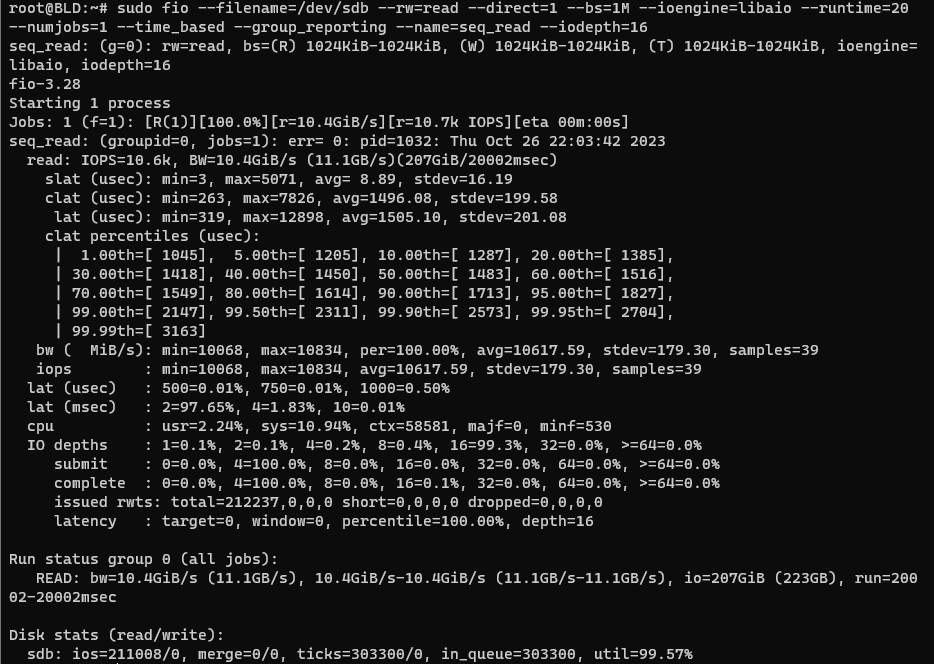
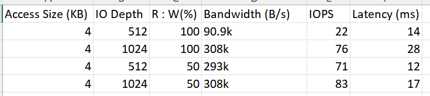
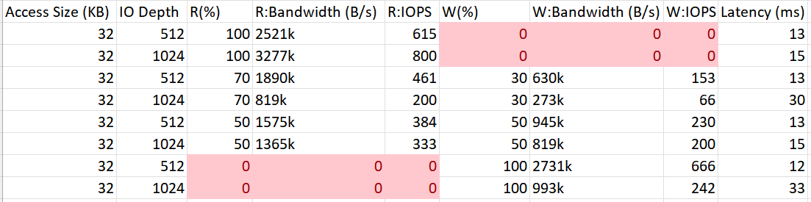
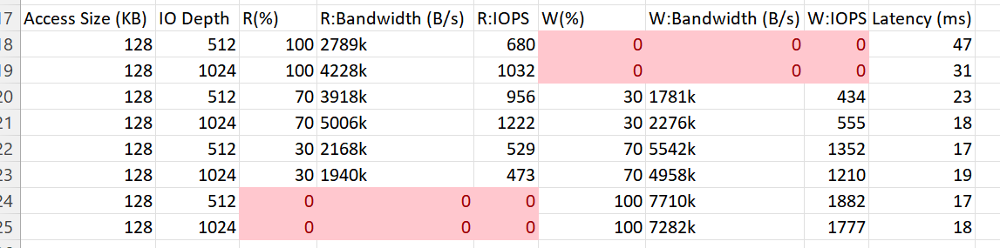

## Course Project #3: SSD Performance Profiling
The purpose of this project is to profile the performance of modern SSDs. I am going to use the Flexible IO tester (FIO), which is available at https://github.com/axboe/fio to profile the performance of my SSD. Its man page is https://linux.die.net/man/1/fio. FIO is a storage device testing tool widely used in the industry. Following will be a set of experiments to measure the SSD performance (latency and throughput) under different combinations of the following parameters: 

(1) data access size (e.g., 4KB/16KB/32KB/128KB) 

(2) read vs. write intensity ratio (e.g., read-only, write-only, 50%:50% and 70%:30% read vs. write)

(3) I/O queue depth (e.g., 0~1024). Note that throughput is typically represented in terms of IOPS (IO per second) for small access size (e.g., 64KB and below), and represented in terms of MB/s for large access size (e.g., 128KB and above).

---


### DUT -> SSD : WD Blue SN570 1TB

---
### Using the FIO tool - Basics

If you aren't immediately familiar with the FIO tool, getting basic performance values from it are simple. Here are some example cases below.

(1) Performs sequential reads on ssd

```
sudo fio --filename=/dev/sdb --rw=read --direct=1 --bs=1M --ioengine=libaio --runtime=20 --numjobs=1 --time_based --group_reporting --name=seq_read --iodepth=16
```

The easiest thing you can do, which is non-destructive is a sequential read command. Sequential just means the LBAs (logical block addresses) are in order. This is typical for a large file, where the filesystem puts all the data for a single file together on the disk. On an HDD most disk access will be sequential, so this is a good way to easily test the bandwidth of a drive.

(2) Random read instruction to a file

```
fio --name=small_test --size=128k --filename=/where/to/write/test_file --direct=1 --rw=randread --iodepth=512
```

The --size option changes the data access size. In the example above, the test is run with data access size 128k.

The --iodepth option controls how many outstanding I/O requests can be progress at the same time.

Furthermore, the job above can be easily changed to a write job if you replace --rw=randread to --rw=write or --rw=randwrite

(3) Changing Read vs Write intensity ratio

```
fio --name=small_test --size=128k --filename=/where/to/write/test_file --direct=1 --rw=randrw --rwmixread=70 --iodepth=1024
```

Using the flags --rw=randrw & --rwmixread=70 configures the job to do random reads and writes with ratio 70:30. Of course this number can be changed to 50 for an even split or 30 for a 30:70 read/write ratio. 

#### Example Outputs

(1) Sequential reads on ssd
<p align="center">  </p>

(2) Random read to file

<p align="center">  </p>

(3) Mixed Read/Write

<p align="center">  </p>

---

### Experiment Data

(i) 

<p align="center">  </p>

As we can see, in the first case with 100% reads, increasing the I/O depth from 512 to 1024 lead to increased throughput and reduced average latency.

When the read:write ratio is 50:50, the SSD shows similar throughput in both Bandwidth and IOPS for the 2 queue depths. I expected to see a latency trade-off as well but I think for such a small block size, there is no visible effect as the SSD can perform the random reads and writes easily.

(ii)

<p align="center">  </p>

As the I/O depth increased from 512 to 1024, the performance metrics generally improve. Higher I/O depth allows for more concurrent I/O operations, leading to increased throughput and reduced latency. Furthermore, the data shows that latency tends to be lower with higher I/O depth and a lower read:write ratio. When the read percentage increases, read performance (read bandwidth and read IOPS) improves while write performance decreases, and vice versa.

(iii)

<p align="center">  </p>

Again, increasing the I/O depth from 512 to 1024 generally lead to improved performance metrics. This aligns with the queueing theory, where increasing concurrency (I/O depth) can reduce queuing and service times, leading to higher system throughput. For the majority of my testing, I didn't notice large changes in the latency of my SSD as I think the workload wasn't large enough to notice any trends.

---
### Conclusion

In general, there is an inverse relationship between latency and throughput. As throughput (measured in B/s or IOPS) increases, latency tends to decrease. Conversely, as throughput decreases, latency tends to increase. This relationship I perceived from my SSD is mostly consistent with fundamental principles in computer systems and storage. The data also suggests that with an optimized balance between reads and writes, the trade-off between latency and throughput can be mitigated to maximize the use-cases of the storage device/system.
